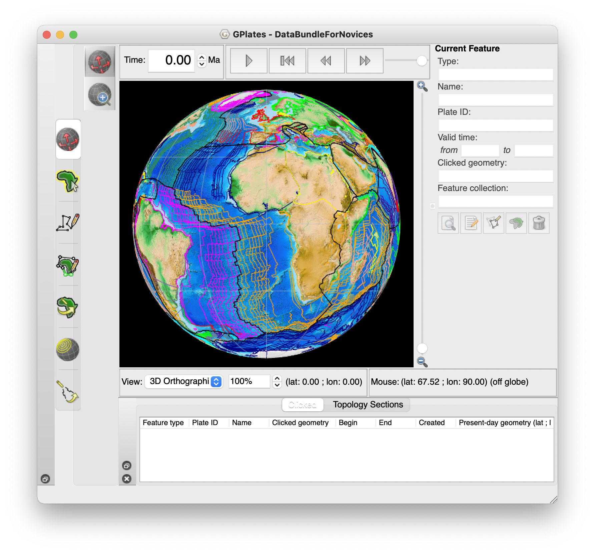
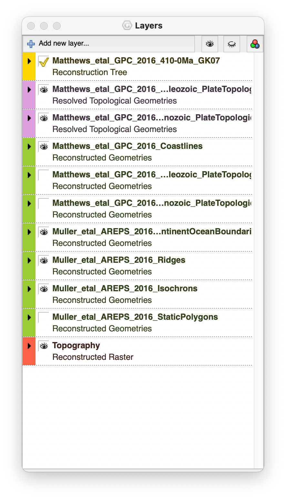
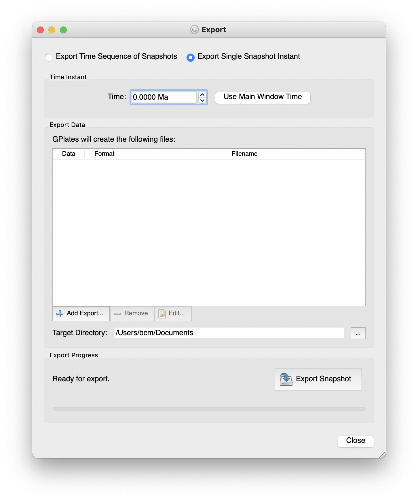
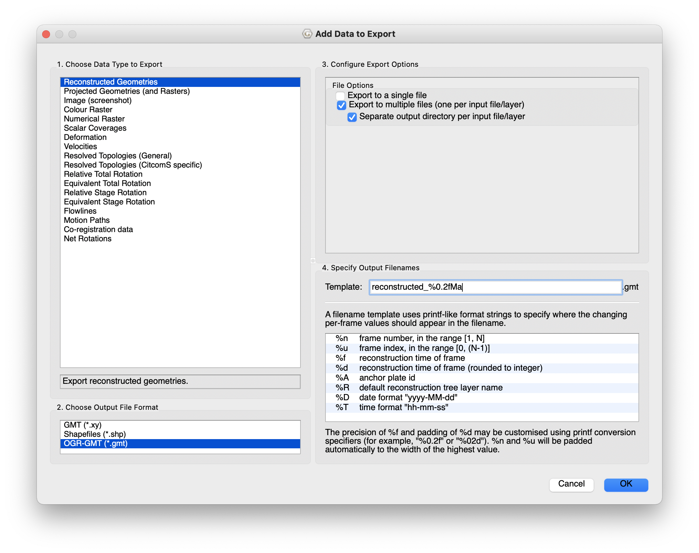

# Introduction #

This guide takes you through two different work flows to create palaeogeographical maps and plot occurrences fossil taxa in R. All the code and data are in this GitHub repository: <https://github.com/benjaminmoon/palaeomap_example>

You can download and run this code directly on your machine, or follow along online at Binder where I've created an environment with all of the data you need. Click the link below to open this in your web browser.

[](https://mybinder.org/v2/gh/benjaminmoon/palaeomap_example/HEAD?urlpath=rstudio)

The Binder link will open in your browser in the RStudio interface. Open the file `palaeomap_labgroup.Rmd` from the file browser to get started.


# Palaeogeographical Maps #

Maps are essential when discussing occurrences of taxa, both in the present and the past. Chuck in the issues associated with continental drift, and it can be difficult to place the wider context of some fossil occurrences. 'These marine fossils are found at the top of a mountain, but where were the oceans 150 million years ago?' Here are a couple of recent examples discussing the spread of occurrences, in this case Jurassic marine reptiles.


Reconstructing global palaeogeography has been an ongoing task for many decades, and both local and global reconstructions and compendia have been made [e.g. @Bradshaw1992GSLM]. But the case of making maps to show many occurrences by hand can be difficult and time-consuming.

A few examples of groups that have made efforts to create palaeogeographical maps at various points through the Phanerozoic include Ron Blakey at _Deep Time Maps_ (<https://deeptimemaps.com>) and Christopher Scotese leading the _Paleomap Project_ (<http://scotese.com>).

<iframe src="https://player.vimeo.com/video/315907106?title=0&byline=0&portrait=0" width="640" height="320" frameborder="0" allow="autoplay; fullscreen; picture-in-picture" allowfullscreen></iframe>
<p><a href="https://vimeo.com/315907106">DeepTimeMaps_Animation_Mollweide_Sample</a> from <a href="https://vimeo.com/42degreesnorth">42 Degrees North Media</a> on <a href="https://vimeo.com">Vimeo</a>.</p>

<!-- 
-->


While built from models of plate tectonics and continental drift, these are nonetheless individual time points in a continuous series and open to some interpretation.

## GPlates ##

GPlates (<https://www.gplates.org>) is free software that reconstructs the movement of tectonic plates through geological history. Using models of plate movement, the configuration can be reconstructed at arbitrary points in the past. Onto this, the palaeoenvironments of the formations at their current positions can be overlain, and so the positions of landmasses, mountains, coastlines, and marine settings can be plotted long back in time.

The download from GPlates provides lots of example data and projects to show the various plates, tectonics, plumes and other information that can be included. New data are being added as research is published. Try, for instance, the _DataBundleForNovices_ project (`GplatesSampleData/DataBundleForNovices`) to see a combined model of modern continents and ocean spreading over the last 410 million years.





There is also a GPlates Web Service (GWS; <http://gws.gplates.org>) that can provide some of the same data without the software. I'll look briefly at this first.

## Exercises 1 ##

1. Find an example of a palaeogeographical map for your favourite time period.
2. Have a look in the folder `GplatesSampleData` to see what other projects are included. 


# Automatic map plotting in R #

A couple of packages already exist for using GPlates reconstructions to create palaeogeographical maps in R:

* NonaR/paleoMap (<https://github.com/NonaR/paleoMap>)
  - NB Has not been updated in several years.
* LunaSare/gplatesr (<https://github.com/LunaSare/gplatesr>)
  - More recently updated, and similar to above.

Both of these download from GWS. I've borrowed some of their functions for this lab group.

If you're unfamiliar with RStudio or RMarkdown (`.Rmd` files), then the code sections are placed in 'chunks' like the one below. You can run individual lines by Cmd+Enter or Ctrl+Enter, or run the whole chunk using the little green arrow to the top right of each chunk. Try with this chunk below if you want.

```{r setup}
library(broom)
library(dplyr)
library(forcats)
library(ggplot2)
library(ggthemes)
library(mapproj)
library(purrr)
library(readr)
library(rgdal)
library(stringr)
library(tibble)
# library(tidyverse) # a quick way to load packages, but slow for Binder.

list.files("functions/", pattern = "\\.R", full.names = TRUE) %>%
  walk(source)
```

**NB not all of the chunks below should be run on Binder as some of the code will take a long time or fail to execute.**

## GPlates Web Service ##

GWS can reconstruct the locations of points, coastlines, plates, paths, and features back into the past (<https://github.com/GPlates/gplates_web_service_doc/wiki>). It can also use a variety of different reconstructions. Most relevant is perhaps the @Golonka2007G model, which is often used for palaeocoordinate reconstruction in the Palaeobiology Database (PBDB).

The process is:

1. Download outlines of the continental coastlines.
2. Download outlines of the tectonic plates.
3. Read and convert these into a format that R and _ggplot2_ can use,
  - this uses the packages _rgdal, readr,_ and _broom._
4. Plot,
  - in this case with _gpplot._

**Example code only. Do not run.** The code below does these steps by downloading the data, which will likely take some time.

```{r gws_data, eval = FALSE}
#### DO NOT RUN THIS CODE ####
coastline_gws_url <-
  "http://gws.gplates.org/reconstruct/coastlines/?time=155&model=GOLONKA"
polygons_gws_url <-
  "http://gws.gplates.org/reconstruct/static_polygons/?time=155&model=GOLONKA"

kimmeridgian_coastlines <-
  rgdal::readOGR(coastline_gws_url) %>%
    broom::tidy()
kimmeridgian_polygons <-
  rgdal::readOGR(polygons_gws_url) %>%
    broom::tidy()
```

This chunk below replicates the above using data I've already downloaded from GWS and stored in the GitHub repository, and can be used on Binder. It has the same steps of loading and tidying the data, then includes the commands to plot with _ggplot2._

**Feel free to run this code.**

```{r gws_plot, fig.width = 7, fig.height = 4, fig.cap = "**Outlines of continental plates in the Kimmeridgian (155 Ma).** Plates in the continental model are shaded grey, while the modern coastlines are outlined. Data downloaded from the GPlates web service.", warning = FALSE, message = FALSE, results = "hide"}
# Load and tidy the data 
kimmeridgian_coastlines <-
  readOGR(
    "data/GWS/Matthews_etal_GPG_2016_Coastlines_reconstructed_155.00Ma.gmt"
  ) %>%
  tidy()
kimmeridgian_polygons <-
  readOGR(
    "data/GWS/Matthews_etal_GPG_2016_Polygons_reconstructed_155.00Ma.gmt"
  ) %>%
  tidy()

ggplot() +
  geom_map(
    data = kimmeridgian_polygons,
    map = kimmeridgian_polygons,
    aes(x = long, y = lat, map_id = id),
    fill = "#D8D8D8"
  ) +
  geom_map(
    data = kimmeridgian_coastlines,
    map = kimmeridgian_coastlines,
    aes(x = long, y = lat, map_id = id),
    colour = "#222222", fill = NA, size = 0.3
  ) +
  coord_map("mollweide") +
  map_border() +
  theme_map()
```

When plotting, the data are added as layers, each plotting over the other: plate polygons at the bottom then coastlines on top. I've also set the map projection to be [Mollweide](https://en.wikipedia.org/wiki/Mollweide_projection), but you can play with this and change it to others included in the _mapproj_ package function [`mapproject`](https://rdrr.io/cran/mapproj/man/mapproject.html). Options include `"Gilbert"`, `"fisheye"`, and `"hex"`. (Use, for example, `coord_map("fisheye", n = 0.7)` to add extra arguments.)

Additionally I've added a border (`map_border()`, in the `functions` folder) and used a basic theme (`theme_map()`) to get a plain background.

## How R plots these map data ##

The positions and extent of map areas from data in GPlates are stored as a series of _polygons._ Each region is outlined by a series of points that form a closed shape, filled with a particular colour. This is exported from GPlates as OGR-GMT format, with file extension `.gmt`, which lists each point that marks the corner of a polygon. In R, _broom_ converts this to a tibble (similar to a data.frame) that has the _x_ and _y_ locations of each point, and a series of columns that identify which polygon that point belongs to. These ID columns are important to make sure that polygons contain the correct points and are closed properly. Without these, there would only be a single shape that would stretch across the whole globe and not make much sense.

## Not quite right ##

GWS is convenient for data and access, but the results in the plot above show the current continental coastlines and the plates. This does not reflect the ancient coastlines that were really after. Also, many of the countries are cross-cut by the polygons that form the sections in the model, which are untidy and typically not visible.

We need to go to the next level: _true palaeogeographical reconstructions._ Fortunately GPlates offers that too.

## Exercises 2 ##

1. Have a look at the [GWS documentation](<https://github.com/GPlates/gplates_web_service_doc/wiki>). What address would you use to get reconstructed coastlines in the early Carboniferous using the @Matthews2016GPC model?
2. Open an example of the OGR-GMT data from the GWS, either from the `data/GWS` folder or by downloading it. Can you see how the polygons are stored? How are different polygons identified?
3. Now look at the tidied version in R, i.e. `kimmeridgian_coastlines` or `kimmeridgian_polygons`. By default this will only show the first 10 rows, but you can see more with, for example, `head(kimmeridgian_polygons, n = 50L)`. Can you see how the OGR-GMT data is transferred to this tidy format?
4. Play around with the inputs to the plot above. How messy or colourful can you make this map? What options are there in `theme_map()`? (Hint: use `?theme_map` to see.)


# 'True' Palaeogeographical Outlines #

Among the projects included with the GPlates download is the set of palaeogeographical reconstructions by @Cao2017Bb for the last 402 my. These are based, and so should align nicely, with the @Golonka2007G model that is used for data in the PBDB, which we'll get to below. These data are in `GPlatesSampleData/FeatureCollections/Palaeogeography/Global/`.

@Cao2017Bb used a combination of previous palaeogeographical reconstructions, and updated the coastlines, mountains, and extent of land and ice caps using occurrence data from the PBDB. In a few locations, what had been reconstructed as land produced marine fossils, when accounting for the movement of plates, and vice versa.

These reconstructions include four layers that have the separated palaeoenvironmental regions:

* Shallow marine: shelf seas.
* Land: terrestrial habitats outlined by coastlines.
* Mountain: areas of mountain building and uplift.
* Ice cap: polar regions that have substantial evidence for long term presence of ice.

These are given the abbreviations 'sm', 'l', 'm' and 'i'. It's worth noting that the way these are built means that the layers have to be plotted in the order above – shallow marine first, ice cap last. There are various areas that overlap (Australia especially) so the order of overlay becomes important in making the correct boundaries visible.

## Export from GPlates ##

The @Cao2017Bb reconstructions aren't available from GWS, but can be exported from GPlates directly using the menu item _Reconstruction > Export…_ Like above I've already done this for an example data set, in this case using the Late Jurassic (Kimmeridgian, 155 Ma) as an example. To make your own, once in the export window:

1. Select the time of export (can  be set from the main window time).
    - Also an option to export a series at regular intervals.
2. The layers to export
    1. select _Add Export…_ under Export Data
    2. choose _Reconstructed Geometries_
    3. output as _OGR-GMT_
    4. choose single or multiple files
        + I prefer multiple: you get one file for each of sea/land/mountain/ice. This is the form that works with the code below.
    5. _OK_
3. Change _Target directory:_ to somewhere you can find.
3. _Begin Export_





The example data are in `data/palaeogeography` as three `.gmt` files that describe the polygon outlines for each of the layers. Note that as there are no ice caps at this time, there are only three files/layers. Look at the Carboniferous of later Palaeogene to get some ice caps.

## Read in the map data ##

I find it useful to tie together the layers and colours from the beginning of importing – this ensures keeping the layers in the order for plotting. The data files are:

* `lm_402_2_reconstructed_155.00Ma.gmt`: landmass
* `m_402_2_reconstructed_155.00Ma.gmt`: mountain
* `sm_402_2_reconstructed_155.00Ma.gmt`: shallow marine

This short code snippet sets lists the layer names and assigns the colours for each layer on the map – they are similar to those shown in GPlates, but not quite the same. I've also used `#DAD3FF` for ice caps when needed. (Technically this isn't used for the colours, that's in the `palaeogeog_map_niceties` function, this is somewhat a remnant of a previous way that I made this.)

```{r map_layers}
map_layers <-
  c(
    "Land"           = "#FFD23A",
    "Mountain"       = "#FF8D51",
    "Shallow marine" = "#45D8FF"
  )
```

With that ready, the following code reads and tidies the data (as for above), then adds a column (geog_layer) to identify the data layer (shallow marine, land, mountain) and joins all the data together. It's very _tidyverse_ based, so I'd suggest looking at <https://www.tidyverse.org> to see the rationale and how they link using the _pipe_ (`%>%`). You can also see more about individual functions in the R help.

The final step is to create a column (polygon_id) to identify each region on the, which come after mountain map. I had a long issue where different continents would join up, or Australia's land would always appear plotted underneath the sea. As described above, this is because the shapes on the map are plotted as separate polygons, and the IDs are repeated between each of the layers. We'll use the polygon_id column to make sure that each polygon has a unique ID by joining the layer, group and id name from the tidied data.

```{r read_polygon_data}
polygon_data <-
  list.files("data/palaeogeography/", pattern = ".gmt", full.names = TRUE) %>%
    map(readOGR) %>%
    map(tidy) %>%
    map2(
      names(map_layers),
      ~ add_column(.x, geog_layer = .y)
    ) %>%
    bind_rows() %>%
    mutate(
      polygon_id = str_c(id, group, geog_layer) %>% as_factor(),
      geog_layer = factor(geog_layer, labels = names(map_layers))
    )
```

## Arranging the map layers ##

At this point it's important to have the map layers in the correct order, so that marine is plotted under land, which is plotted under mountain.

This piece of code does that for you, ensuring shallow marine is first (it was third in `map_layers` above) then assigning this order to the polygon_id column. It converts the polygon_id column to a factor and re-orders thee levels based on the reordered `map_layers`.

```{r rearrange_polygon_labels}
id_level_order <-
  map_layers[c(3, 1, 2)] %>%
    map(
      function(layr) polygon_data$polygon_id %>% levels() %>% str_which(layr)
    ) %>%
    unlist()

polygon_data <-
  polygon_data %>%
    mutate(
      polygon_id = fct_relevel(polygon_id, levels(polygon_id)[id_level_order])
    )
```

## Plotting the map ##

Unfortunately, using the same plot layer method as for the GWS data above is a little excessive. You would have to add a new annotation for each layer (just about okay for three, tedious for more), which then multiplies when plotting reconstructions of many times.

```{r many_annotations, eval = FALSE}
# DO NOT RUN THIS CODE
ggplot() +
  geom_map() +
  geom_map() +
  geom_map() + …
```

Instead, you can use the function `geom_polygon` and have the different layers plotted automatically with the colours assigned above. The _fill_ is the most important argument as that assigns the main bulk of the colour. The _colour_ argument is the outline, which you shouldn't use bas that will outline the map layers and change their shape. The `colour` argument will be used when plotting occurrence points (see below). Also having the ordered and correctly grouped _polygon_id_ is important here as that determines how the individual polygons are grouped and closed, preventing shapes from spanning the globe, or incorrectly overlapping.

I'll point out here that there's quite a lot going on in the `palaeogeog_map_niceties` function at the end. This is a collection of theme options and a colour scale to show the map properly. In particular this adds the outline and the lines of the equator and tropics. I guess one thing to note is that the 'tropics', in a biodiversity sense, may not be the same in the past as the present. Increased temperatures can change the latitudinal biodiversity gradient. Also, obliquity and precession change the latitudes of the astronomical tropics through time.

```{r plot_base_map, fig.width = 7, fig.height = 4, fig.cap = "**Palaeogeography in the Kimmeridgian (155 Ma).** Palaeogeographical reconstruction from @Cao2017Bb. Lines of latitude indicate the locations of the Equator and Tropics (±23.5°)."}
# dev.new(width = 7, height = 4)
map_plot <-
  ggplot() +
    geom_polygon(
      data = polygon_data,
      aes(
        x      = long,
        y      = lat,
        fill   = geog_layer,
        group  = polygon_id
      ),
      colour = NA
    ) +
    coord_map("mollweide") +
    theme_map() +
    palaeogeog_map_niceties()
map_plot
```

You can try changing the look by modifying the projection (`coord_map`) and play about with some of the colours and markings by editing the function `palaeogeog_map_niceties` (`functions/palaeogeog_map_niceties.R`). You can also add further annotations (<https://ggplot2-book.org/annotations.html#annotations>) or change labels as you wish.

## Going further 1: locating with modern coastlines ##

You may also want to add outlines of modern coastlines to show where these are and help locating. Again these are not available from GWS, but can be exported from GPlates. In GPlates, from _File > Open Feature Collection…_ go to `GplatesSampleData/FeatureCollections/Coastlines` and load `Matthews_etal_GPC_2016_Coastlines_Polyline.gpmlz`. This adds a new layer into GPlates with areas of modern coastline in their relative positions for the time. Not all the modern coastlines are there as not all of these have certain locations, or rock to be found at – these come and go at different time points.

Like above, you can export this layer from GPlates. In this repo, I've already done that to `data/coastlines/`, which you can load with this code.

```{r read_coastline_polygons, results = "hide"}
modern_coastlines <-
  readOGR("data/coastlines/Matthews_etal_GPC_2016_Coastlines_Polyline_reconstructed_155.00Ma.gmt") %>%
    tidy() %>%
    add_column(geog_layer = "Modern coastlines") %>%
    mutate(polygon_id = str_c(id, group, geog_layer) %>% as_factor())
```

This layer needs the same organising of IDs as the palaeogeography above, but once done can be easily added to `map_plot` above. This is where it's useful to save your ggplot to an object alongside printing it – this you can just add new layers on top of the base map.

```{r plot_coast_outlines, fig.width = 7, fig.height = 4, fig.cap = "**Palaeogeography in the Kimmeridgian (155 Ma).** Outlines of modern coastlines (where known) are included in grey. Palaeogeographical reconstruction from @Cao2017Bb. Lines of latitude indicate the locations of the Equator and Tropics (±23.5°)."}
map_plot +
  geom_path(
    data = modern_coastlines,
    aes(
      x = long,
      y = lat,
      group = polygon_id,
    ),
    colour = "#888888", size = 0.3
  )
```

## Exercises 3 ##

1. Try plotting this map with different projections (see above and `?mapproject`). Does this work well for all projections? Why?
2. Look at the code behind `palaeogeog_map_niceties()` (in `functions/palaeogeog_map_niceties.R`). Modify this to add different lines of latitude. Can you add lines of longitude too? What about changing the colour?
  - _ggplot_ objects can have new layers added to them one-by-one by using `+`, but you can also combine them into function containing a list of layers that can be added in a single line.
  - Hint: to change the colour of the map layers, use `fill`.
3. Can you try creating your own palaeogeographical map for your favourite time? This should be done on your own computer. Follow the instructions above to export data from GPlates then plot in R, making sure you change all the file and object names.


# Adding Fossil Occurrences #

## Getting occurrence data ##

Now that you've spent lots of time making a pretty map, let's plot some fossils on top of it.

Of course, being me and having used Jurassic data, we're going to plot some ichthyosaurs. In this instance, the occurrence data comes from the PBDB, downloading ichthyosaur occurrences with these filters:

- Callovian–Tithonian (166-145 Ma)
- all levels of taxonomy – no filtering.

The PBDB has its own web API (<https://paleobiodb.org/data1.2>) from which you can get occurrences, collections, taxonomy and other things. In the code chunk below I've crafted the URL to download the data, but this is already in the repo so doesn't need to be run.

**Do not run the following chunk, the data is already in the repo.**

```{r download_pbdb_data, eval = FALSE}
#### DO NOT RUN THIS CHUNK ####
pbdb_url <-
  "https://paleobiodb.org/data1.2/occs/list.csv?base_name=Ichthyosauromorpha&interval=Callovian,Oxfordian,Kimmeridgian,Tithonian&show=paleoloc"

occ_ichthyosaurs <-
  read_csv(pbdb_url)
```

The part of the URL `show=paleoloc` is the important bit as the PBDB has already computed the palaeocoordinates of most occurrences using their modern location and the ages of the occurrences. Conveniently using the same default GPlates model as the palaeogeography.

## Plotting occurrences ##

With that all done, use the chunk below to add the occurrences onto the base map. These are plotted with `geom_point()`, which you may be familiar with, setting the _x_ and _y_ values to the palaeolongitude and palaeolatitude respectively.

```{r plot_occurrences, fig.height = 4, fig.width = 7, fig.cap = "**Occurrences of ichthyosaurs from the Callovian–Tithonian.** Palaeogeographical map shows the distribution of land in the Kimmeridgian (155 Ma) reconstructed by @Cao2017Bb. Occurrences of Ichthyosauromorpha are from the Palaeobiology Database.", warning = FALSE}
occ_ichthyosaurs <-
  read_csv("data/occurrences/2021-02-18-ichthyosaur-occurrences.csv")
occ_plot <-
  map_plot +
    geom_point(
      data = occ_ichthyosaurs,
      aes(
        x = paleolng,
        y = paleolat
      )
    )
occ_plot
```

The more eagle-eyed of you may notice that some of these _marine_ ichthyosaur occurrences are located resolutely in the middle of landmasses. There are a few possible reasons for that:

1. The palaeogeographical reconstruction is wrong.
2. The modern location for the occurrence is wrong, so the palaeocoordinates are wrong.
3. The age of the occurrence is wrong, so its reconstructed position is wrong.

These three are worth considering further. 

_Incorrect palaeogeographical reconstruction_ is perhaps the most obvious answer: these reconstructions are difficult and there will always be some uncertainty with reconstructing the earth 155 million years ago. However, the method of @Cao2017Bb included palaeoenvironments reconstructed using PBDB data to improve confidence in the borders of sea and land. The palaeogeography should match the PBDB well then, particularly in well-studied and sampled periods and locations. There are, however, some parts that cannot certainly reconstructed because of a lack of data, rock availability, or accessibility.

_Incorrect modern location_ may be the easiest to discount as localities tend to be spatially constrained and identifiable, even in older literature. This being the case, there should only be minor error in the locations of occurrences (~10s km).

_Incorrect age assignment_ is probably the most likely cause, or perhaps better _imprecise_ ages. The palaeocoordinates calculated for each occurrence in the PBDB use the midpoint of its temporal range. Sometimes this range can be quite large, such as the several species of _Undorosaurus_ that cover the whole Late Jurassic (163.5–145 Ma in [GTS 2020/03](https://stratigraphy.org/ICSchart/ChronostratChart2020-03.pdf)). Those specimens from Patagonia that are plotted in the middle of the land are also similarly imprecisely dated. Their palaeocoordinates are reconstructed to the middle Kimmeridgian, whereas they are likely later (given the occurrence of ichthyosaurs from similar locations) when there was a sea there to swim in.

As the ichthyosaur occurrences included over over 20 my of earth history there will be changes in palaeogeography, and some potentially imprecise dating.

The ways around this are to have more time slices with the occurrences plotted, but this complicates the code and any plots, and such precise reconstructions may not be available. Alternatively, aim to use only the most precisely dated occurrences, if possible, but this can remove lots of useful data. Ultimately, you may just have to accept that some marine occurrences may appear on land, or vice versa.

## Going further 2: separating occurrences with facets ##

The final thing that you can try is the _faceting_ power of _ggplot2_ to separate the different groups of occurrences. Below, this code splits out the occurrences by their accepted taxonomic rank. Most occurrences are just non-diagnostic vertebral material, so can't be assigned to a family, genus or species. These are listed under 'unranked_clade'.

Conveniently, creating facets is as simple as adding a single line.

```{r facet_plot, fig.width = 7, fig.height = 14, fig.cap = "**Occurrences of ichthyosaurs in the Callovian–Tithonian separated by identified rank.** Palaeogeographical maps shows distribution of land in the Kimmeridgian (155 Ma) reconstructed by @Cao2017Bb.", warning = FALSE}
occ_plot +
  facet_wrap(vars(accepted_rank), ncol = 2)
```

## Exercises 4 ##

1. Look at the PBDB web API (<https://paleobiodb.org/data1.2>). What other options and data sets can you access with this? Can you craft a URL that will download occurrence data of Tithonian bivalves.
  - This download may not work on Binder, so you should do it in R on your own computer.
2. Try adding colour or shapes to you occurrence points using the options in `geom_point`.
3. Download and plot the palaeogeographical map and occurrences for your favourite group in your favourite stage. Again this should be done on your own computer. Beware it may take a while if you want to plot many occurrences.
4. It's also useful to separate out occurrences on the map, for instance, can you colour occurrences within the outside the tropics differently? say red in the tropics (±23.5°) and blue outside.
  - Hint: you can use the palaeocoordinates of the PBDB data to assign a group to each occurrence, use this to colour the points in `geom_point`.
  - Hint: use `scale_colour_discrete` to colour the points. See the code of `palaeogeog_map_niceties` (`functions/palaeogeog_map_niceties.R`) for an example of doing this.


# Suggested solutions to exercises #

Not all of the exercise questions have a single obvious solution, particularly ones where you pick your favourite period. But here are some code suggestions for you to check against.

## Exercises 1 ##

1. Find an example of a palaeogeographical map for your favourite time period.
  - You can have a look at Deep Time Maps or Paleomap for easy examples, or you can find others in papers.
2. Have a look in the folder `GplatesSampleData` to see what other projects are included. 
  - The `GplatesSampleData/FeatureCollections` directory is the one to look at. It includes:
    + Other plate reconstructions.
    + Ocean boundaries.
    + Plate flow lines.
    + Large igneous provinces … among other things.

## Exercises 2 ##

1. Have a look at the [GWS documentation](<https://github.com/GPlates/gplates_web_service_doc/wiki>). What address would you use to get reconstructed coastlines in the early Carboniferous using the @Matthews2016GPC model?
  - `"https://gws.gplates.org/reconstruct/coastlines/?&time=350&model=MATTHEWS2016_mantle_ref"`
  - You could also use `"MATTHEWS2016_pmag_ref"`. These are two different reconstruction methods.
2. Open an example of the OGR-GMT data from the GWS, either from the `data/GWS` folder or by downloading it. Can you see how the polygons are stored? How are different polygons identified?
  - The metadata at the top has lines beginning with `# @`, including describing how the data for each polygon is organised.
  - Each polygon has a line of metadata describing it and `@P` indicating it's a polygon.
  - Sometimes without metadata for each polygon, they are indicated with numbers: `@P1`, `@P2` etc.
3. Now look at the tidied version in R, i.e. `kimmeridgian_coastlines` or `kimmeridgian_polygons`. By default this will only show the first 10 rows, but you can see more with, for example, `head(kimmeridgian_polygons, n = 50L)`. Can you see how the OGR-GMT data is transferred to this tidy format?
  - The data is stored in a tibble with each point in a row and columns for the longitude and latitude of the points.
  - The order that the points should be plot and the piece, group, and id of the polygon that they belong to are also included to separate the shapes.
  - These ID columns are taken from the metadata for each polygon define in the input OGR-GMT file.
4. Play around with the inputs to the plot above. How messy or colourful can you make this map? What options are there in `theme_map()`? (Hint: use `?theme_map` to see.)
  - I'll leave this to your imagination.

## Exercises 3 ##

1. Try plotting this map with different projections (see above and `?mapproject`). Does this work well for all projections? Why?
  - Some of the projections move the line of 0° longitude away from the centre or have polygons that cross from one side of the map to the other. This can sometimes lead to shapes being drawn right across the map. I'm not sure whether the best way to counteract this is in redrawing the polygons or something to do with the map projection.
2. Look at the code behind `palaeogeog_map_niceties()` (in `functions/palaeogeog_map_niceties.R`). Modify this to add different lines of latitude. Can you add lines of longitude too? What about changing the colour?
  - In `palaeogeog_map_niceties` I stored the lines of latitude that I want as a tibble that describe _line segments._ New lines of latitude can be added by creating a new row with the value _y_ set to your latitude. The lines are described as going from -180°–+180° longitude at a specific single latitude.
  - For lines of longitude, I'd suggest using a new `geom_segment` layer. Modify the code so that the _y_ value covers the range of latitudes –90°–+90° at a specific longitude. Here's an example drawing lines of longitude at -50°, 0° and 72°:

```{r exercise3.2, eval = FALSE}
geom_segment(
  data = tibble(
    x = c(-50, 0, 72),
    y = rep(-90, 3),
    yend = rep(90, 3)
  ),
  aes(x = x, xend = x, y = y, yend = yend),
  colour = "grey70", size = 0.3
)
```

3. Can you try creating your own palaeogeographical map for your favourite time? This should be done on your own computer. Follow the instructions above to export data from GPlates then plot in R, making sure you change all the file and object names.
  - here you'll have to modify the code above for your own GPlates data. Remember to add in the ice caps to the layer if you pick a time with these, such as the Carboniferous or the Neogene.

## Exercises 4 ##

1. Look at the PBDB web API (<https://paleobiodb.org/data1.2>). What other options and data sets can you access with this? Can you craft a URL that will download occurrence data of Tithonian bivalves.
  - "https://paleobiodb.org/data1.2/occs/list.csv?base_name=Bivalvia&interval=Tithonian&show=paleoloc" 
2. Try adding colour or shapes to your occurrence points using the options in `geom_point`.
  - Use the `colour` and `shape` arguments.
3. Download and plot the palaeogeographical map and occurrences for your favourite group in your favourite stage. Again this should be done on your own computer. Beware it may take a while if you want to plot many occurrences.
  - Use the code above, but change the relevant URLs and data files to your own GPlates and PBDB data. Don't forget to add ice caps if you have them.
  - Hopefully the PBDB API will be working as it wasn't when I was writing this!
4. It's also useful to separate out occurrences on the map, for instance, can you colour occurrences within the outside the tropics differently? say red in the tropics (±23.5°) and blue outside.
  - You'll need to assign a column of identifiers for tropical and non-tropical occurrences. Below is an example using the _dplyr_ function `case_when`.
  - With that done it'll fit right into the plotting code from earlier, but you will need to specify the `colour` argument. If you want to make it blue and red then you can add a scale.

```{r exercise4.4, fig.width = 7, fig.height = 4, fig.cap = "**Occurrences of ichthyosaurs in the Callovian–Tithonian indicated by latitude region.** Palaeogeographical maps shows distribution of land in the Kimmeridgian (155 Ma) reconstructed by @Cao2017Bb."}
ex_occ_ichthyosaurs <-
  occ_ichthyosaurs %>%
    mutate(
      tropical = case_when(
        paleolat <= 23.5 & paleolat >= -23.5 ~ "tropical",
        paleolat > 23.5 | paleolat < -23.5   ~ "non-tropical"
      ) %>%
        as_factor()
    )

ex_occ_plot <-
  map_plot +
    geom_point(
      data = ex_occ_ichthyosaurs,
      aes(
        x = paleolng,
        y = paleolat,
        colour = tropical
      ),
      na.rm = TRUE
    ) +
    scale_discrete_manual(
      values = 
        c(
          "tropical" = "red",
          "non-tropical" = "blue"
        ),
        aesthetics = c("colour"),
        name = "Latitude"
      )
ex_occ_plot
```


# References #

