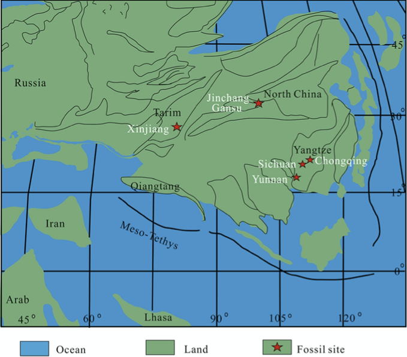
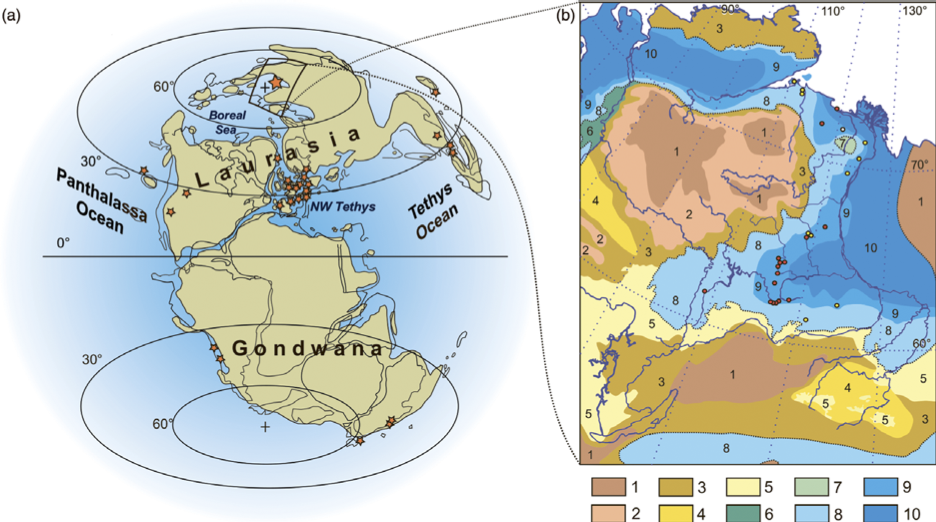

* [ ] Describe map plotting and polygons
* [ ] Separate function files
* [ ] Add exercises
  - [ ] look at OGR data
  - [ ] reconstruct other map and occurrences
  - [ ] separate latitude with colours
  - [ ] add exercise answers
* [ ] Revise to second person
* [ ] Proofread


# Introduction #

This guides takes you through two different methods to create palaeogeographical
maps and plot occurrences from pretty much any database. 

You can run this code directly on your machine, or follow along at Binder where
I've created an environment to run with all of the data you need. Click the link
below to open this in your web browser.

[](https://mybinder.org/v2/gh/benjaminmoon/palaeomap_example/HEAD?urlpath=rstudio)

The Binder link will open in RStudio in your browser. Open the file
`palaeomap_labgroup.Rmd` from the file browser to get started.


# Palaeogeographical Maps

Maps are essential when discussing occurrences of taxa, both in the present and
the past. Chuck in the issues associated with continental drift, and it can be
difficult to resolve the wider context of some fossil occurrences. These marine
fossils are found at the top of a mountain, but where were the oceans 150
million years ago? Here are a couple of examples of papers discussing Jurassic
marine reptiles.





Reconstructing global palaeogeography has been an ongoing task for many decades,
and both local and global reconstructions and compendia have been made [e.g. @Bradshaw1992GSLM]. But the
case of making maps to show many occurrences, plotting these by hand can be
difficult and time-consuming.

A few examples of groups that have made efforts to create palaeogeographical
maps at various points through the Phanerozoic include Ron Blakey at _Deep Time
Maps_ (<https://deeptimemaps.com>) and Christopher Scotese leading the _Paleomap
Project_ (<http://scotese.com>).

<iframe src="https://player.vimeo.com/video/315907106?title=0&byline=0&portrait=0" width="640" height="320" frameborder="0" allow="autoplay; fullscreen; picture-in-picture" allowfullscreen></iframe>
<p><a href="https://vimeo.com/315907106">DeepTimeMaps_Animation_Mollweide_Sample</a> from <a href="https://vimeo.com/42degreesnorth">42 Degrees North Media</a> on <a href="https://vimeo.com">Vimeo</a>.</p>

<!-- 
-->


While built from models of plate tectonics and continental drift, these are
nonetheless individual time points in a continuous series.

## GPlates ##

GPlates (<https://www.gplates.org>) is free software that reconstructs the
movement of tectonic plates through geological history. Using models of plate
movement, the configuration can be reconstructed at arbitrary points in the
past. Onto this, the palaeoenvironments of the formations at their current
positions can be overlain, and so the positions of landmasses, mountains,
coastlines, and marine settings can be plotted long back in time.

The download from GPlates provides lots of example data and projects to show the
various plates, tectonics, plumes and other information that can be included.
New data are being added as research is published. Try, for instance, the
_DataBundleForNovices_ project (`GPlatesSampleData/DataBundleForNovices`) to see
a combined model of modern continents and ocean spreading over the last 410
million years.

There is also a GPlates Web Service (<http://gws.gplates.org>) that can provide
some of the same data without the software. I'll look briefly at this first.


# Automatic map plotting in R #

A couple of packages already exist for using GPlates reconstructions to create
palaeogeographical maps in R:

* NonaR/paleoMap (<https://github.com/NonaR/paleoMap>)
  - NB Has not been updated in several years.
* LunaSare/gplatesr (<https://github.com/LunaSare/gplatesr>)
  - More recently updated, and similar to above.

Both of these download from the GWS API. I've borrowed some of their
functions for this lab group.

If you're unfamiliar with RStudio or RMarkdown (`.Rmd` files), then the code
sections are placed in 'chunks' like the one below. You can run individual lines
by Cmd+Enter or Ctrl+Enter, or run the whole chunk using the little green arrow
to the top right of each chunk. Try now if you want.

```{r setup}
library(broom)
library(dplyr)
library(forcats)
library(ggplot2)
library(ggthemes)
library(mapproj)
library(purrr)
library(readr)
library(rgdal)
library(stringr)
library(tibble)
# library(tidyverse) # a quick way to load packages, but slow for Binder.

source("functions/functions.R")
```

**NB not all of the chunks below should be run as some of the code will take a
long time or fail to execute on Binder.**

## GPlates Web Service ##

The GPlates Web Service (GWS) can reconstruct the locations of points, coastlines,
plates, paths, and features back into the past
(<https://github.com/GPlates/gplates_web_service_doc/wiki>). It can also use a
variety of different reconstructions. Most pertinent is perhaps the
@Golonka2007G model, which is often used for palaeocoordinate reconstruction in
the Palaeobiology Database.

The process is straightforward:

1. Download outlines of the continental coastlines.
2. Download outlines of the tectonic plates.
3. Read and convert these into a format that R and _ggplot2_ can use.
    - this uses the packages _rgdal, readr,_ and _broom._
4. Plot.

**Example code only. Do not run this.** The code below does that by downloading
the data, which will likely take a long time.

```{r gws_data, eval = FALSE}
#### DO NOT RUN THIS CODE ####
coastline_gws_url <-
  "http://gws.gplates.org/reconstruct/coastlines/?time=155&model=GOLONKA"
polygons_gws_url <-
  "http://gws.gplates.org/reconstruct/static_polygons/?time=155&model=GOLONKA"

kimmeridgian_coastlines <-
  rgdal::readOGR(coastline_gws_url) %>%
    broom::tidy()
kimmeridgian_polygons <-
  rgdal::readOGR(polygons_gws_url) %>%
    broom::tidy()
```

This chunk below replicates the above using data I've already downloaded from
GWS and stored in Binder/GitHub repository. It has the same steps of loading and
tidying the data, then includes the commands to plot with _ggplot2._

**Feel free to run this code.**

```{r gws_plot, fig.width = 7, fig.height = 4, fig.cap = "**Outlines of continental plates in the Kimmeridgian (155 Ma).** Data downloaded from the GPlates web service.", warning = FALSE, message = FALSE, results = "hide"}
# Load and tidy the data 
kimmeridgian_coastlines <-
  readOGR(
    "data/GWS/Matthews_etal_GPG_2016_Coastlines_reconstructed_155.00Ma.gmt"
  ) %>%
  tidy()
kimmeridgian_polygons <-
  readOGR(
    "data/GWS/Matthews_etal_GPG_2016_Polygons_reconstructed_155.00Ma.gmt"
  ) %>%
  tidy()

# Plot with ggplot
ggplot() +
  geom_map(
    data = kimmeridgian_polygons,
    map = kimmeridgian_polygons,
    aes(x = long, y = lat, map_id = id),
    fill = "#D8D8D8"
  ) +
  geom_map(
    data = kimmeridgian_coastlines,
    map = kimmeridgian_coastlines,
    aes(x = long, y = lat, map_id = id),
    colour = "#222222", fill = NA, size = 0.3
  ) +
  coord_map("mollweide") +
  map_border() +
  theme_map()
```

When plotting with _ggplot2,_ the different data has to be added at layers, each
plotting over the other: plate polygons at the bottom then coastlines on top.
I've also set the map projection to be
[Mollweide](https://en.wikipedia.org/wiki/Mollweide_projection), but you can
play with this and change it to others included in the _mapproj_ package
function [`mapproject`](https://rdrr.io/cran/mapproj/man/mapproject.html).
Options include `"Gilbert"`, `"fisheye"`, and `"hex"`. (Use, for example,
`coord_map("fisheye", n = 0.7)` to add extra arguments.)

Additionally I've added a border (`map_border`) and used a basic theme
(`these_map`) to get rid of any usual _ggplot2_ extras.

## Not quite right ##

G'S is convenient for data and access, but the results in the plot above show
the current continental coastlines and the plates. This does not reflect the
ancient coastlines that were really after. Also, many of the countries are
cross-cut by the polygons that form the sections in the model, which are untidy
and typically not visible.

We need to go to the next level: _true palaeogeographical reconstructions._
Fortunately GPlates offers that too.


# 'True' Palaeogeographical Outlines

Among the models included with the GPlates download is the reconstructions by
@Cao2017Bb for the last 402 my. These are based, and so should align nicely,
with the @Golonka2007G model and the data in the PBDB, which we'll get to
shortly. This is available as a project in the GPlates software
(`GPlatesSampleData/FeatureCollections/Palaeogeography/Global/`) that you can
look.

This model reconstructs four layers based on palaeoenvironmental data from the
PBDB, updating previous versions:

* Shallow marine: shelf seas.
* Land: terrestrial habitats outlined by coastlines.
* Mountain: areas of mountain building and uplift.
* Ice cap: polar regions that have substantial evidence for ice.

These are given the abbreviations 'sm', 'l', 'm' and 'i'. It's worth noting that
the way these are built means that the layers have to be plotted in the order
above – shallow marine first, ice cap last. There are various areas that overlap
(Australia especially) so the order of overlay becomes important in getting the
correct boundaries.

## Export from GPlates ##

The @Cao2017Bb models aren't available from GWS, but can be exported from
GPlates directly using the menu item _Reconstruction > Export…_ Like above I've
already done this for an example data set, in this case using the Late Jurassic
(Kimmeridgian, 155 Ma) as an example. To make your own, once in the export
window:

1. Select the time of export (can  be set from the main window time).
    - Also an option to export a series at regular intervals.
2. The layers to export
    1. select _Add Export…_ under Export Data
    2. Choose _Reconstructed Geometries_
    3. Output as _OGR-GMT_
    4. choose single or multiple files
        + I prefer multiple: you get one file for each of sea/land/mountain/ice.
    5. _OK_
3. Change _Target directory:_ to somewhere you can find.
3. _Begin Export_

The example data can be found in `data/palaeogeography` as three `.gmt` files that
describe the polygon outlines for each of the layers. Note that as there are no
ice caps at this time, there are only three files/layers.

## Read in the map data ##

I find it useful to tie together the layers and colours from the beginning of
importing – this ensures keeping the layers in the order for plotting.
The data files are:

* `lm_402_2_reconstructed_155.00Ma.gmt`: landmass
* `m_402_2_reconstructed_155.00Ma.gmt`: mountain
* `sm_402_2_reconstructed_155.00Ma.gmt`: shallow marine

This short code snippet sets the colours that I want to use – they are similar
to those shown in GPlates, but not quite the same. I've also used `#DAD3FF` for
ice caps when needed, which come after mountain.

```{r map_layers}
map_layers <-
  c(
    "Land"           = "#FFD23A",
    "Mountain"       = "#FF8D51",
    "Shallow marine" = "#45D8FF"
  )
```

With that ready, the following code reads and tidies the data (as for above),
then adds a column (geog_layer) to identify the data layer (shallow marine, land, mountain)
and joins all the data together. It's very _tidyverse_ based, so I'd suggest
looking at <https://www.tidyverse.org> to see the rationale and how they link.
You can also see more about individual functions in the R help.

The final step is to create a column (polygon_id) to identify each region on the
map. I had a long issue where different continents would join up, or Australia's
land would always appear plotted underneath the sea.

This is because the various shapes on the map are plotted as outlines that need
to be linked and closed separately. Joining the data for the three layers
creates duplicate ids so that these different shapes become erroneously joined.
Adding a new column that combines the id for each shape and the layer corrects
this.

```{r read_polygon_data}
polygon_data <-
  list.files("data/palaeogeography/", pattern = ".gmt", full.names = TRUE) %>%
    map(readOGR) %>%
    map(tidy) %>%
    map2(
      names(map_layers),
      ~ add_column(.x, geog_layer = .y)
    ) %>%
    bind_rows() %>%
    mutate(
      polygon_id = str_c(id, group, geog_layer) %>% as_factor(),
      geog_layer = factor(geog_layer, labels = names(map_layers))
    )
```

## Arranging the map layers ##

At this point it's important to have the map layers in the correct order, so
that marine is plotted under land, which is plotted under mountain.

This piece of code does that for you, ensuring shallow marine is first (it was
third in `map_layers` above) then assigning this order to the polygon_id column.

```{r rearrange_polygon_labels}
id_level_order <-
  map_layers[c(3, 1, 2)] %>%
    map(
      function(layr) polygon_data$polygon_id %>% levels() %>% str_which(layr)
    ) %>%
    unlist()

polygon_data <-
  polygon_data %>%
    mutate(
      polygon_id = fct_relevel(polygon_id, levels(polygon_id)[id_level_order])
    )
```

## Plotting the map ##

Unfortunately, using the same plot layer method as for the GWS data above is a
little excessive. I tried to add a new annotation for each layer, which then
multiplied when plotting reconstructions of many times.

```{r many_annotations, eval = FALSE}
# DO NOT RUN THIS CODE
ggplot() +
  geom_map() +
  geom_map() +
  geom_map() + …
```

Instead, you can use the function `geom_polygon` and have the different layers
plotted automatically with the colours assigned above. The _fill_ is the most
important as that assigns the main bulk of the colour. The _colour_ argument is
the outline, which I include to 'smooth' the continental outlines a little (with
a thin line) – you may wish to remove this. Also having the ordered and correctly grouped _polygon_id_ is
important here as that determines how the individual polygons are grouped and
closed, preventing shapes from spanning the globe.

I'll point out here that there's quite a lot going on in the
`palaeogeog_map_niceties` function at the end. This is a collection of theme
options and colour scale to show the map properly. In particular this adds the
outline and the lines of the equator and tropics. I guess one thing to note is
that the 'tropics', in a biodiversity sense, may not be the same in the past as
the present. Increased temperatures can change the latitudinal biodiversity
gradient. Also, obliquity and precession change the latitudes of the
astronomical tropics through time.

```{r plot_base_map, fig.width = 7, fig.height = 4, fig.cap = "**Palaeogeography in the Kimmeridgian (155 Ma).**", echo = FALSE}
# dev.new(width = 7, height = 4)
map_plot <-
  ggplot() +
    geom_polygon(
      data = polygon_data,
      aes(
        x      = long,
        y      = lat,
        fill   = geog_layer,
        colour = geog_layer,
        group  = polygon_id
      ),
    ) +
    coord_map("mollweide") +
    theme_map() +
    palaeogeog_map_niceties()
map_plot
```

You can try changing the look by modifying the projection (`coord_map`) and play
about with some of the colours and markings by editing the function
`palaeogeog_map_niceties` (`functions/palaeogeog_map_niceties.R`). You can also
add further annotations
(<https://ggplot2-book.org/annotations.html#annotations>) or change labels as
you wish.

## Going further 1: locating with modern coastlines ##

I have also added outlines of modern coastlines to show where these are and
help orientation. Again these are not available from GWS, but can be exported
from GPlates. In GPlates, from _File > Open Feature Collection…_ go to
`GplatesSampleData/FeatureCollections/Coastlines` and load
`Matthews_etal_GPC_2016_Coastlines_Polyline.gpmlz`. This adds a new layer into
GPlates with areas of modern coastline in their relative positions for the time.
Not all the modern coastlines are there as not all of these have certain
locations, or rock to be found at – these come and go at different time points.

Like above, you can export this layer from GPlates. In this repo ,I've already
done that to `data/coastlines/`, which can be loaded as below.

```{r read_coastline_polygons, results = "hide"}
modern_coastlines <-
  readOGR("data/coastlines/Matthews_etal_GPC_2016_Coastlines_Polyline_reconstructed_155.00Ma.gmt") %>%
    tidy() %>%
    add_column(geog_layer = "Modern coastlines") %>%
    mutate(polygon_id = str_c(id, group, geog_layer) %>% as_factor())
```

This layer needs the same organising as the palaeogeography above, but once done
can be easily added to `map_plot` above. This is where it's useful to save your
ggplot to an object alongside printing it.

```{r plot_coast_outlines, fig.width = 7, fig.height = 4, fig.cap = "**Palaeogeography in the Kimmeridgian (155 Ma).** Outlines of modern coastlines (where known) are included in grey."}
map_plot +
  geom_path(
    data = modern_coastlines,
    aes(
      x = long,
      y = lat,
      group = polygon_id,
    ),
    colour = "#888888", size = 0.3
  )
```


# Adding Fossil Occurrences #

Now that you've spent lots of time making a pretty map, let's plot some fossils
on top of it.

## Getting occurrence data ##

Of course, being me and having used Jurassic data, we're going to plot some
ichthyosaurs. In this instance, the occurrence data comes from the PBDB,
downloading ichthyosaur occurrences with these filters:

- Callovian–Tithonian (166-145 Ma)
- all levels of taxonomy – no filtering.

The PBDB has its own web API (<https://paleobiodb.org/data1.2>) from which you
can get occurrences, collections, taxonomy and other things. In the code chunk
below I've crafted the URL to download the data, but this already in the repo so
doesn't need to be run.

**Do not run the following chunk, the data is already in the repo.**

```{r download_pbdb_data, eval = FALSE}
# DO NOT RUN THIS CHUNK
pbdb_url <-
  "https://paleobiodb.org/data1.2/occs/list.csv?base_name=Ichthyosauromorpha&interval=Callovian,Oxfordian,Kimmeridgian,Tithonian&show=paleoloc"

occ_ichthyosaurs <-
  read_csv(pbdb_url)
```

The part of the URL `show=paleoloc` is the important bit as the PBDB has already
computed the palaeocoordinates of most occurrences using their modern location
and the ages of the occurrences. Conveniently using the default GPlates model
used to map the palaeogeography.

## Plotting occurrences ##

With that all done, use the chuck below to add the occurrences onto the base
map. These are plotted with `geom_point`, which you may be familiar with,
setting the x and y values to the palaeolongitude and palaeolatitude
respectively.

```{r plot_occurrences, fig.height = 4, fig.width = 7, fig.cap = "**Occurrences of ichthyosaurs from the Callovian–Tithonian.** Palaeogeographical map shows the distribution of land in the Kimmeridgian (155 Ma).", warning = FALSE}
occ_ichthyosaurs <-
  read_csv("data/occurrences/2021-02-18-ichthyosaur-occurrences.csv")
occ_plot <-
  map_plot +
    geom_point(
      data = occ_ichthyosaurs,
      aes(
        x = paleolng,
        y = paleolat
      )
    )
occ_plot
```

The more eagle-eyed of you may notice that some of these _marine_ ichthyosaur
occurrences are located resolutely in the middle of landmasses. There are a few
possible reasons for that:

1. The palaeogeographical reconstruction is wrong.
2. The modern location for the occurrence is wrong, so the palaeocoordinates are
   wrong.
3. The age of the occurrence is wrong, so its reconstructed position is wrong.

These three are worth considering in detail.

_Incorrect palaeogeographical reconstruction_ is perhaps the most obvious
answer: this is difficult to do and there will always be some uncertainty with
reconstructing the earth 155 million years ago. However, the method used by
@Cao2017Bb involved using PBDB data to reconstruct the borders of sea and land
based on the facies that occurrences are in. The palaeogeography should match
the PBDB well then, particularly in well-studied and sampled periods and
locations. There are, however, some parts that cannot certainly reconstructed
because of a lack of data, rock availability, or accessibility.

_Incorrect modern location_ may be the easiest to discount as localities tend to
be spatially constrained and identifiable, even in older literature. This being
the case, there should only be minor error in the locations of occurrences (~10s
km).

_Incorrect age assignment_ is probably the most likely cause, or perhaps better
_imprecise_ ages. The
palaeocoordinates calculated for each occurrence in the PBDB use the midpoint of
its temporal range. Sometimes this range can be quite large, such as the several
species of _Undorosaurus_ that cover the whole Late Jurassic (163.5–145 Ma in
[GTS 2020/03](https://stratigraphy.org/ICSchart/ChronostratChart2020-03.pdf)).
Those specimens from Patagonia that are plotted in the middle of the land are
also similarly imprecisely dated. Their palaeocoordinates are reconstructed to
the middle Kimmeridgian, whereas they are likely later (given the occurrence of
ichthyosaurs from similar locations) when there was a sea there to swim in.

As the ichthyosaur occurrences included over over 20 my of earth history there
will be changes in palaeogeography, and some potentially imprecise dating.

The ways around this are to have more time slices with the occurrences plotted,
but this complicates the code and any plots. Alternatively, aim to use only the
most precisely dated occurrences, if possible, but this can remove lots of
useful data. Ultimately, you may just have to accept that some marine
occurrences may appear on land, or vice versa.

## Going further 2: separating occurrences with facets ##

The final thing that you can try is to use the _faceting_ power of _ggplot2_ to
separate our different groups of occurrences. Below, this code splits out the
occurrences by their accepted taxonomic rank. Most occurrences are just
non-diagnostic vertebral material, so can't be assigned to a family, genus or species.
These are listed under 'unranked_clade'.

Conveniently, creating facets is as simple as adding a single line.

```{r facet_plot, fig.width = 7, fig.height = 14, fig.cap = "**Occurrences of ichthyosaurs in the Callovian–Tithonia separated by identified rank.** Palaeogeographical maps shows distribution of land in the Kimmeridgian (155 Ma).", warning = FALSE}
occ_plot +
  facet_wrap(vars(accepted_rank), ncol = 1)
```


# Exercises #


